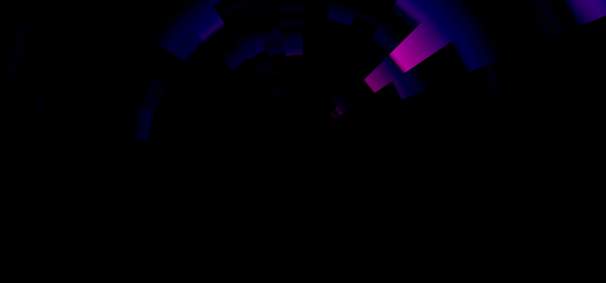

# 1st Term Project Diary
- [1st Term Project Diary](#1st-term-project-diary)
  - [20/11/04](#201104)
  - [20/11/08](#201108)
  - [20/11/13](#201113)
  - [20/11/27](#201127)
  - [20/12/02](#201202)
  - [20/12/18](#201218)
  - [20/12/30](#201230)
  - [21/01/04](#210104)
  - [21/01/05](#210105)
  - [21/01/06](#210106)
  - [21/01/07](#210107)
  - [20/01/08](#200108)
  - [21/01/09](#210109)
  - [21/01/11](#210111)
  - [- update schedule](#--update-schedule)
  - [21/01/14](#210114)
  - [21/01/25](#210125)
  - [21/02/20](#210220)

---

## 20/11/04
**Main Concept**

 _Create a (visually pleasing) environment in VR which reacts to music._

* analyze audio and pass values of frequency regions (FFT)
* have elements react to values / value changes of assigned frequency regions
  * play assigned animation at threshold
  * map (transform) parameter to frequency regions' value 
* ability to view scene with VR headset

**Worst Case**

* ability to analyze audio and pass values of frequency regions for **one single song**
* have elements react to values / value changes of assigned frequency regions
  * play assigned animation at threshold
  * map (transform) parameter to frequency regions' value 
* ability to view scene with VR headset

**Best Case**

* **implement ability for user to play any song he wants**
  * **implement file explorer in UI / implement streaming API ( SoundCloud ? )**
* ability to analyze audio and pass values of frequency regions for **every given song**
* have elements react to values / value changes of assigned frequency regions
  * **give user ability to fine-tune pre-assigned frequency regions (on the fly)**
    * play assigned animation at threshold
    * map (transform) parameter to frequency regions' value 
      * **give user ability to fine-tune mapped parameters (on the fly)**
* ability to **view multiple scenes** with VR headset
  * **implement UI to transition between scenes**

---

## 20/11/08

_searched around for inspiration and audio-reactive works in Unity_

**Particle Audio Spectrum - Unity Package Asset** by [luxgile](https://github.com/luxgile)

[GitHub](https://github.com/luxgile/Particle-Audio-Spectrum)

**Unity VFX Graph / particles reacting to audio** by [Ji young Kim](https://www.youtube.com/channel/UCdyKY9xtRFDhcDihMKpxELg)

**String Theory (Music Visualization)** by [Chris Jones](https://www.chrisj.com.au/)

")

**Lapalux - '4EVA (feat. Talvi)'** by [Lapalux](https://www.youtube.com/channel/UC--yIemFNSgwQ0JxyYsABAQ)

'")

Animation: Jakub Valtar

Art Direction: Marielle Tepper

---

* Unity's AudioSource GameObject has a [method called "GetSpectrumData"](https://docs.unity3d.com/ScriptReference/AudioSource.GetSpectrumData.html) which handles all the FFT and is able to return frequencies' values
* particle systems reacting seem to be the easiest to completely immerse the user in the music visualization
  * problem: it's hard to see exactly which particles are reacting to what, experience could be more that _something_ seems to be reacting _somehow_ to music
* the waveform itself can become an element
  * by constantly creating new waveforms in front of the user and letting the older ones fly by a tunnel effect can be achieved ( maybe speed affected by loudness ? )
* the rendering itself can become affected by audio and break / gitch according to song

---

## 20/11/13

_had a talk with my advisor, Lena, today and she made some good points_

**What is my project _actually_ about? Just visualizing music is pretty whack.**

**Why does it have to be in VR? What can VR do for my project, that can't be done else?**

One overarchieving theme could be **learning about and exploring music on a deeper level**. Visualizations of frequencies could have the chance that user's are able to see sounds they didn't hear at first and then concentrate on them to actually hear them. Like how you sometimes find interesting places in streets you thought you knew, just because you spotted them on Google Map's visualization of your surrondings.

Visualization of music has the chance to break up the complexity of some songs in seperate parts, without disrupting the sonic experience.
* A "tutorial" could make the user aware of what the element's animated represent: which frequency spectrum and what instrument's usually play there. In-Game it would be then easier to associate movement's of the elements to changes to in the frequency
* Looking at an element could also trigger a pop-up displaying technical information: What frequency spectrum is represented, show it's current value or it's value change over x time

Still, we **need a way to make use of the virtual environment and it's space**.
* Maybe use spatial audio to highlight certain frequencies at certain locations?
* Maybe give the user the ability to "walk" through parts of the song, visualized as waveforms?

**IDEA FOR THE THEME**

The VR headset is a "musical micoscope", giving you the ability to look into the sonic waves and their changes over time. You enter the world and you're in a scenery resembling something like the matrix. There are waveforms, frequency bands and all kind of stuff in your crazy labratory.

The style is a mixture of Ghetto-Cyberpunk or Steamwork and artificial digital screens.

---

## 20/11/27

_had a talk with my advisor again_

* 3D Spectrum as landscape
* Learning through itneracitivity
* Interaction changes visualization (changes music (lowpass etc.), so people learn as well?)

---

## 20/12/02

_presented my project and got nice input_

* Interacitivity can also mean adding sound objects ?
* Use Chroma feature or Chromagram instead of FFT because it "evens" out frequencies and displays frequencies' amplitudes more like they are actually heard by us

---

## 20/12/18

_talk with advisor Lena_

* [Made a schedule](schedule.md) for the upcoming weeks
  * Lena gave input on wether or not it's possible / does make sense

---

## 20/12/30

_One thing's for sure: we're not ahead of schedule_

**_DONE_**
- implemented background threaded audio analysis
  * [This implementation of it by Jesse from Giant Scam now is the base of my project](https://medium.com/giant-scam/algorithmic-beat-mapping-in-unity-preprocessed-audio-analysis-d41c339c135a)

**_(NEW) PROBLEMS_**
- we get **too much data** to display!

**_TODO_**
- reduce data in a smart way

---

## 21/01/04

_First day of the project week: tried to build the world by reducing the data but still ran into problems._

**_DONE_**
- reduced the number of frequency bands to 24 by taking the median of a region

**_(NEW) PROBLEMS_**
- FFT data seems fishy, maybe I implemented it wrong?
  - the average also shouldn't (?) be the way to go, so maybe I have to rewrite it
- even with reduced "detail" of frequency, it's still to much for the instantiating approach:
  - 24 * > 12 000 (for a 4-minute song) data points in time = 288 000
    - the solution might be to instantiate maybe 10 000 objects at the beginning and then just reposition them after they move out of sight ?

**_TODO_**
- Fix / understand FFT
- implement a way to just have a set amount of objects and reposition them according to the audio's playback position

---

## 21/01/05

_FFT, FFT, FFT, FFT, FFT, FFT ..._

**_DONE_**
- reduced the amount of data properly
  - now using the max amplitude of a frequency range, seems to work better
- read lots about the workings of FFT and DSPlib

**_TODO_**
- figure out what exactly the data I recieve from the FFT represents and how to properly work with it

---

## 21/01/06

_Lots of figuring out FFTs again, this time trying to work with the data I recieve better._

**_DONE_**
- implemented a (hacky) way to have the data of the FFT result in a spectrum that resembles the representation in a DAW's EQ
- seperated my code into "modules"
  - planned a system of communication between those

**_TODO_**
- my specrum is still not 100% accurate

_The raw FFT data vs the output of a DAW._

_My scaling implementation vs the output of a DAW._

_Sequence diagram._

---

## 21/01/07

_Made lots of progress and build a first prototype resulting in me going to bed with frustration. Why can't everything just work and look perfectly immediately?_

**_DONE_**
- player moves according to audio playback
- first proper building of the world (kind of) as I envisioned it (a tunnel)
- limited objects in the tunnel to 500
  - now rows representing freuencies at a certain time are loaded in as the player progresses

**_(NEW) PROBLEMS_**
- tunnel doesn't look good
  - spacing is way too big

**_TODO_**
- find a way to build the tunnel differently so it looks good

_**Left:** The frequencies' amplitudes represented by scaling boxes and positioning these in a circle (building a tunnel). **Right:** Spectrum as a simple landscape, lows on the left, highs on the right._

---

## 20/01/08

_Now pizza is somehow an integral part of my project, we've come so far. Also lots of talks and advice._

**_DONE_**
- made a new mockup in C4D for the objects the tunnel is made of
  - **_"Pizzaslices"_**: The inner radius of objects changes with the amplitude of the frequency
- talked with Angela about FFT
- talked with Pierred about Unity and how to properly do things
- turned mockup into reality in Unity

**_TODO_**
- implement proper representation of FFT like in the EQ of a DAW
- turn main script into Singleton

_Mockup of a new tunnel._

_Objects the tunnel is made of (pizzaslices)._

_Implementation in Unity._

---

## 21/01/09

_FIRST: Yay, progress! THEN: Let's try it in VR finally. NOW: FML, doesn't work straight away. Sadness._

**_DONE_**
- build a new tunnel out of "pizzaslices"
  - amplitudes of frequency are represented by inner radius of slices
- completed VR setup to make use of Oculus Quest

**_(NEW) PROBLEMS_**
- normal maps of slices are buggy
- no real VR experience, too laggy (0.5 FPS) and doesn't work properly

**_TODO_**
- change algorithm of pizzaslices "back" to rotating objects to fix normal maps by having triangles always drawn in the right direction at 0,0 going upwards and the positioning them circular
- preprocess calculations of vertices to try and fix performance issues on Oculus Quest

---

## 21/01/11

_Today I maybe dug my own grave. We'll see on the 12th of March._

**_DONE_**
- updated documentation, now it actually shows what I did last week
- decided on the [worst and best case](worstbestcase.md) 

**_TODO_**
- update [schedule](schedule.md) 
---

## 21/01/14

_..._

**_DONE_**
- updated schedule
- fixed normal maps by creating all objects at same psition then rotating
- build testscene for VR to quicker make design decisions and test performance
  - when reduced number of objects vr experience not the greatest but acceptable (IN TEST SCENE!) 

**_(NEW) PROBLEMS_**
- performance on Oculus Quest seems like a bigger problem

**_TODO_**
- preprocess vertice points for every object in whole song as well to take every possible processing load off of Oculus Quest

## 21/01/25

_WE GOT IT RUNNING ON THE QUEST! WOOOOOH!!!_

**_DONE_**
- fixed performance on Oculus Quest
  - nothing I tried worked at first when executed on the Quest, but after using Oculus' OVR Profiler tool to get behind the reason why, I found out I was having way too many draw calls (> 2500, recommended are > 100 lol)
  - I'm not generating cubes or pizzaslices anymore
    - instead I'm generating one single mesh, looking exactly like before
      - this reduced the draw calls to 3 (!)
- started styling a little
  - because I'm now generating a single mesh, I'm able to map the frequencies' amplitudes to vertex colors and use these in the shader graph to draw pretty gradients!

**_TODO_**
- make the audio output interactable as planned
  - have the Oculus' controllers be the _controllers_

_Vertex color based gradients! It's a little dark maybe, but that makes it really cool in VR, trust me._

## 21/02/20

_long time no see, we got interactions working_

**_DONE_**
- interactable audio FX:
  - reverb
  - chorus
  - flanger
  - solo specific frequency
    - something, I'm proud of because it's rather clever: There is no actual way to solo a frequency by default. So I used a low- and highpass-filter kind of "inverted" with some hz distance between them to achieve the same effect!
  - mute specific frequency
- right now it's controlled with a 2D UI and the keyboard
  - specifying what frequency to mute / solo works by "flying" down into the section. I think it's a really elegant solution!

**_TODO_**
- have the Oculus' controllers be the _controllers_
- have main menu loading audio in, implement SoundCloud API
